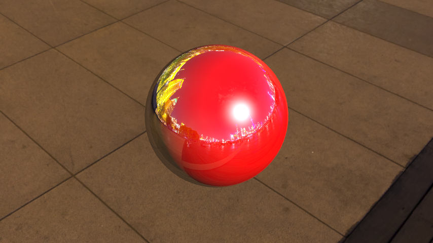
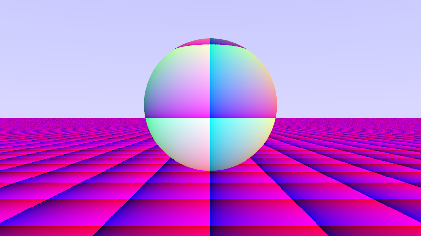
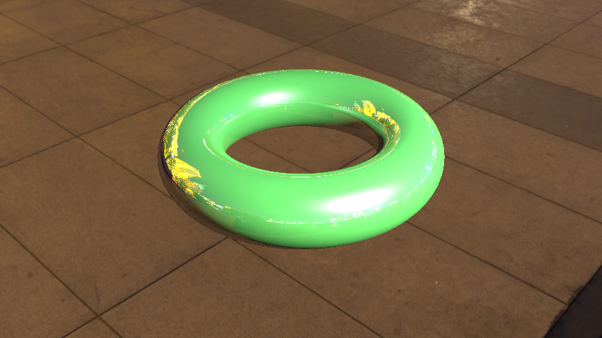
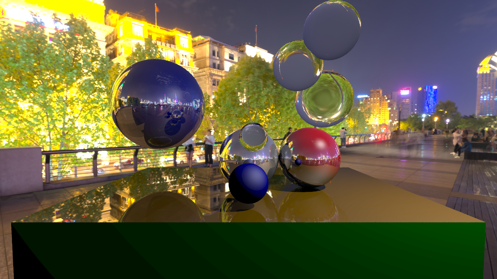
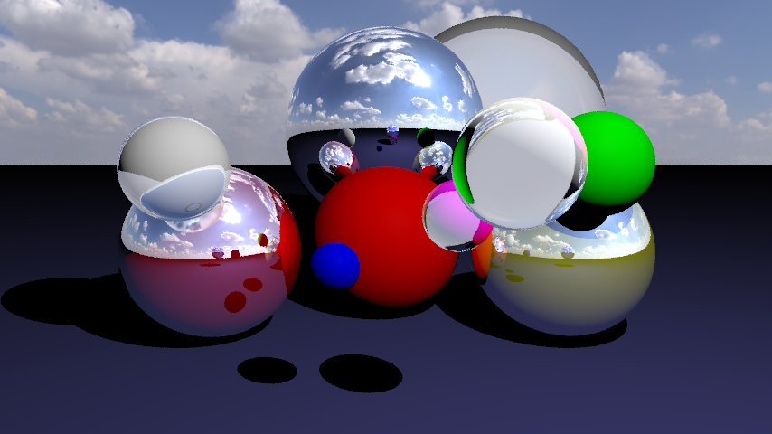
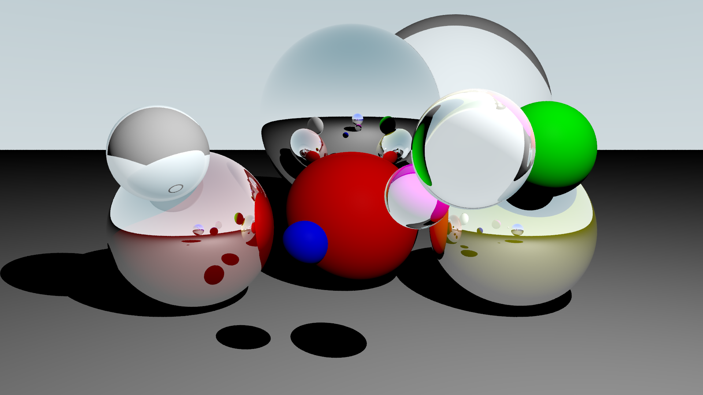
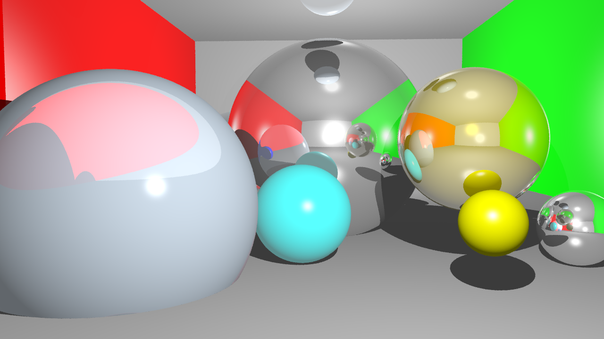
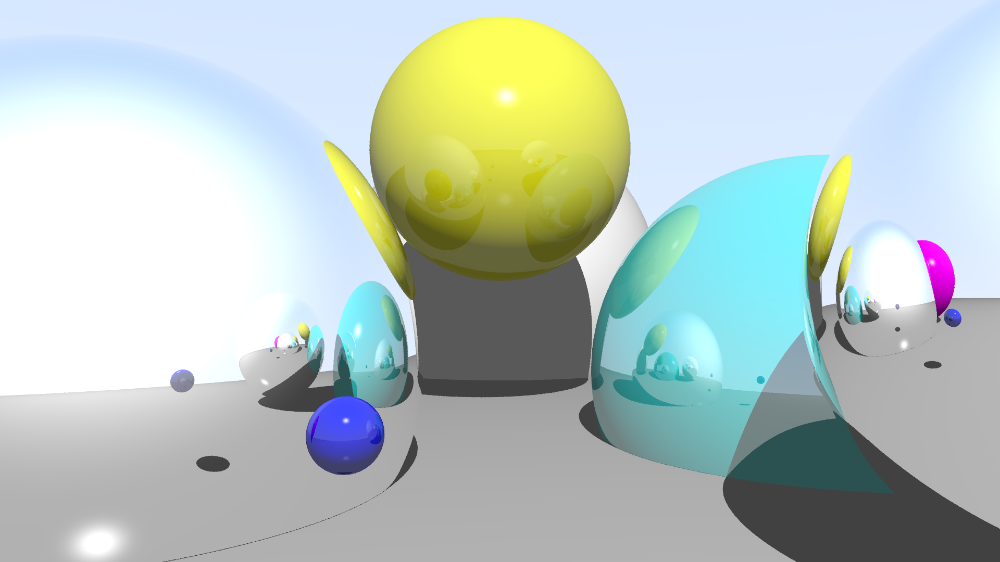

<p align="center">
  
</p>

[ **[⭐️ HOME](./README.md)** &nbsp;|&nbsp;
  **[Theory](./docs/raytracing.md)** &nbsp;|&nbsp;
  **[Examples](./docs/examples.md)** &nbsp;|&nbsp;
  **[Docs & API](./docs/docs.md)** ]


<h1 align="center">Educational Ray Tracer in Python</h1>

<p align="center">
  <a href="https://github.com/HonzaSik/educational-ray-tracer/commits/main">
    
  </a>
  <a href="https://github.com/HonzaSik/educational-ray-tracer/issues">
    
  </a>
  <a href="https://github.com/HonzaSik/educational-ray-tracer/pulls">
    
  </a>
  <a href="./LICENSE">
    
  </a>
</p>

<p align="center">
  <a href="https://github.com/HonzaSik/educational-ray-tracer/stargazers">
    
  </a>
  <a href="https://github.com/HonzaSik/educational-ray-tracer/network/members">
    
  </a>
</p>


<p align="center">
  <b>Ray tracer for educational purposes, implemented in Python for clarity and simplicity.</b><br>
  Project in active development — Structure and features may change frequently.<br>
</p>


<br><br>

---
### 📘 **[Theoretical Background](docs/raytracing.md)**
> Learn the fundamentals of ray tracing, including concepts like rays, intersections, shading models, and more. Best before diving into the code!

---

### 📚 **[Documentation of the Library](docs/docs.md)**
> Comprehensive documentation of the Educational Ray Tracer library, including API references and how each component works.

---

### 🎨 **[Ray-Traced Examples](docs/examples.md)**
> Gallery of images rendered using the Educational Ray Tracer, showcasing its capabilities and features.

---

<br>

# Table of Contents
- ### **[Features](#features---current-capabilities)**
- ### **[Setup & Usage](#setup--usage)**
  - [Setup](#setup)
  - [Usage](#usage)
- ### **[How to Extend](#Custom-Definitions)**
  - [Object](#objects)
  - [Shader](#shaders)
  - [Render Loop](#render-loop-definition)
- ### **[Roadmap & Progress](#roadmap--progress)**
- ### **[License](#license)**


<br>


---

## Features - Current Capabilities
1. Blinn-Phong shading model with support for multiple light sources
2. Basic materials: diffuse, reflective, refractive (glass)
3. Jupyter Notebook examples for easy experimentation and learning
4. Pickle-based scene saving/loading for progress persistence
5. Custom camera setup with adjustable field of view and aspect ratio
6. Basic geometric primitives: spheres, planes, triangles, squares
7. Support for shadows and multiple samples per pixel (spp) for anti-aliasing
8. Modular design for easy extension and modification
9. Basic skybox support in HDR format
10. Configurable rendering parameters: image resolution, max ray depth, samples per pixel
11. Jupyter Notebook custom object definition
12. Jupyter Notebook custom shader definition
13. Jupyter Notebook custom render loop definition

---

## Setup & Usage
#### Setup
```bash
# todo – coming soon this raytracer is still in development
```
#### Usage
```bash
# todo – coming soon this raytracer is still in development
```

<br><br>

# Custom Definitions

## Objects
You can define your own objects by creating a new class that inherits from the `Hittable` base class like:

<details> <summary><b>Click to expand ⤵️</b></summary>

```python
@dataclass
class MySphere(Hittable):
    """
    Sphere in 3D space defined by center, radius, and color.
    """
    center: Vertex
    radius: float
    material: Material

    def normal_at(self, point: Vertex) -> Vector:
        normal = (point - self.center) / self.radius
        return normal

    def intersect(self, ray: Ray, t_min=0.001, t_max=float('inf')) -> HitPoint | None:
        oc = ray.origin - self.center

        # Quadratic coefficients
        a = ray.direction.dot(ray.direction)
        b = 2.0 * oc.dot(ray.direction)
        c = oc.dot(oc) - self.radius * self.radius

        discriminant = b * b - 4 * a * c

        if discriminant < 0: # no intersection
            return None

        sqrt_disc = np.sqrt(discriminant)

        # Find the nearest root
        root = (-b - sqrt_disc) / (2.0 * a)
        if root < t_min or root > t_max:
            root = (-b + sqrt_disc) / (2.0 * a)
            # Point out of bounds
            if root < t_min or root > t_max:
                return None

        hit_point = ray.point_at(root)

        normal = self.normal_at(hit_point)
        # Ensure the normal is facing against the ray
        if ray.direction.dot(normal) > 0.0:
            normal = -normal

        return HitPoint(dist=root, point=hit_point, normal=normal, material=self.material, ray_dir=ray.direction)

    def random_point(self) -> Vertex:
        pass
```


</details>

#### Defined in ./notebooks/objects.ipynb [go to notebook](notebooks/custom_definitions/custom_object.ipynb)

---

<br><br>

## Shaders
You can define your own shaders by creating a new class that inherits from the `ShadingModel` base class like:

<details> <summary><b>Click to expand ⤵️</b></summary>

```python
@dataclass
class MyShader(ShadingModel):
  
    def shade(self, hit: HitPoint, world: World, light: Light, view_dir: Vector, light_direction=None) -> Color:
        return Color.custom_rgb(
            int((hit.point.x % 1) * 255),
            int((hit.point.y % 1) * 255),
            int((hit.point.z % 1) * 255)
        )

    def shade_multiple_lights(self, hit: HitPoint, world: World, lights: list[Light], view_dir: Vector) -> Color:
        for light in lights:
            return self.shade(hit, world, light, view_dir)
```


</details>

#### Defined in ./notebooks/shaders.ipynb [go to notebook](./notebooks/shaders.ipynb)

---

<br><br>

## Render loop definition

<details> <summary><b>Click to expand ⤵️</b></summary>

You can define your own renderloop by creating a new class that inherits from the `RenderLoop` base class like:
```python
@dataclass
class MySimpleRenderLoop(RenderLoop):
    def render_pixel(self, i: int, j: int) -> Tuple[int, int, int]:
        u = (i / (self.width - 1)) - 0.5
        v = ((self.height - 1 - j) / (self.height - 1)) - 0.5
        ray = self.camera.make_ray(u, v)

        col = ray_color(
                ray = ray,
                world = self.world,
                lights = self.lights,
                depth = self.max_depth,
                shader = self.shader,
                skybox = self.skybox
            )
        return to_u8(col.r), to_u8(col.g), to_u8(col.b)
        

    def render_all_pixels(self) -> Tuple[List[Tuple[int, int, int]], int, int]:
        pixels: List[Tuple[int, int, int]] = []

        for row in range(self.height):
            for column in range(self.width):
                pixels.append(self.render_pixel(column, row))

        return pixels, self.width, self.height
```
[](docs/examples/my_simple_render_loop.png)

</details>

#### Custom Render Loop - defined in ./notebooks/renderloops.ipynb [go to notebook](./notebooks/renderloop.ipynb)

---

<br><br>

# Roadmap & Progress

This log shows the evolution of the raytracer.   
**Newest results are shown first.**

**Github lowers the image quality when displaying them in the README, so for best quality check the images in the `docs/examples` folder.**


## Image 5 – Improved Glass + Skybox (Current)
- **Scene:** spheres with better glass material  
- **Features:** experimental reflections/refractions, working skybox  
- **Status:** current development stage  



---

## Image 4 – Skybox (In Progress)
- **Scene:** early skybox experiments  
- **Status:** partial implementation  



---

## Image 3 – Glass Spheres v2 (Old Version)
- **Scene:** more spheres, single light  
- **Glass Material:** second iteration (semi-functional)  
- **Render Specs:** 1920×1080, 6 spp, max depth 7  
- **Performance:** ~15 min (MacBook M1)  



---

## Image 2 – Cornell Box (Old Version)
- **Scene:** simple Cornell Box with spheres  
- **Glass Material:** first working attempt (semi-functional)  



---

## Image 1 – Glass Spheres v1 (Old Version)
- **Scene:** basic spheres with one light source



---

# License
MIT License -
Copyright (c) 2025 Jan Šik

---


<p align="center">
  <b> Documentation is not complete yet. Works as a example of how to document the project. </b>
</p>
