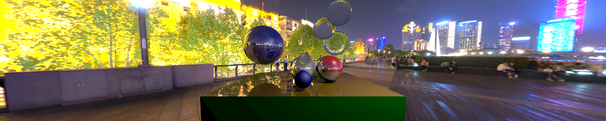

<p align="center">
  
</p>

[ **[⭐️ HOME](./README.md)** &nbsp;|&nbsp;
  **[Theory](./docs/raytracing.md)** &nbsp;|&nbsp;
  **[Examples](./docs/examples.md)** &nbsp;|&nbsp;
  **[Docs & API](./docs/docs.md)** ]


<h1 align="center">Educational Ray Tracer in Python</h1>

<p align="center">
  <a href="https://github.com/HonzaSik/educational-ray-tracer/commits/main">
    
  </a>
  <a href="https://github.com/HonzaSik/educational-ray-tracer/issues">
    
  </a>
  <a href="https://github.com/HonzaSik/educational-ray-tracer/pulls">
    
  </a>
  <a href="./LICENSE">
    
  </a>
</p>

<p align="center">
  <a href="https://github.com/HonzaSik/educational-ray-tracer/stargazers">
    
  </a>
  <a href="https://github.com/HonzaSik/educational-ray-tracer/network/members">
    
  </a>
</p>


<p align="center">
  <b>Ray tracer for educational purposes, implemented in Python for clarity and simplicity.</b><br>
  Project in active development — Structure and features may change frequently.<br>
</p>


<br><br><br>

---


### Before You Start - [Theoretical Background Of Ray Tracing](docs/raytracing.md)
- Go check out the basics before diving into the code. This section provides the theoretical background of ray tracing to better understand the concepts used in this project.
  - [👉 Theoretical Background](docs/raytracing.md)
  
---

### Detailed Usage [Documentation Of The Library ](docs/docs.md)
- Detailed documentation what is this library capable of and how to use it. Goes through all features step by step documenting the current state of the project and its capabilities.
  - [👉 View Docs And API](docs/docs.md)

---

### Examples [Ray Traced Examples ](docs/examples.md)
- Examples of scenes rendered with this ray tracer.
  - [👉 View Examples](docs/examples.md)

---

<br><br><br>

## Table of Contents
- **Overview** [about the project](#overview)
- **Features** [what it can do](#features)
- **Setup & Usage** [how to set it up and use it](#setup--usage)
  - Setup [How to set up](#setup)
  - Usage [How to use](#usage)
- **Custom definitions – Shaders, Objects, Renderloops** [how to create your own components](#custom-definitions--shaders-objects-renderloops)
  - Shaders [Jupyter Notebook custom shader definition (in progress)](#jupyter-notebook-custom-shader-definition-in-progress)
  - Objects [Jupyter Notebook custom object definition](#jupyter-notebook-custom-object-definition)
  - Render Loops [Jupyter Notebook custom renderloop definition (coming later)](#jupyter-notebook-custom-renderloop-definition-coming-later)
- **Roadmap & Progress** [development log with images](#roadmap--progress)
  - **CURRENT** [Image 5 – Improved Glass + Skybox (Current)](#image-5--improved-glass--skybox-current)
  - **OLD** [Image 4 – Skybox (In Progress)](#image-4--skybox-in-progress)
  - **OLD** [Image 3 – Glass Spheres v2 (Old)](#image-3--glass-spheres-v2-old-version)
  - **OLD** [Image 2 – Cornell Box (Old)](#image-2--cornell-box-old-version)
  - **OLD** [Image 1 – Glass Spheres v1 (Old)](#image-1--glass-spheres-v1-old-version)
- **More about ray tracing** [additional resources](#more-about-ray-tracing)
- **License** [MIT License](#license)

<br><br><br>

## Overview
- A simple ray tracer library written in Python, designed for educational purposes. You can find the code in the `src` folder but be aware this project is still in early development and the code structure may change frequently.

---

## Features - Current Capabilities
1. Blinn-Phong shading model with support for multiple light sources
2. Basic materials: diffuse, reflective, refractive (glass)
3. Jupyter Notebook examples for easy experimentation and learning
4. Pickle-based scene saving/loading for progress persistence
5. Custom camera setup with adjustable field of view and aspect ratio
6. Basic geometric primitives: spheres, planes, triangles, squares
7. Support for shadows and multiple samples per pixel (spp) for anti-aliasing
8. Modular design for easy extension and modification
9. Basic skybox support in HDR format
10. Configurable rendering parameters: image resolution, max ray depth, samples per pixel
11. Jupyter Notebook custom object definition
12. Jupyter Notebook custom shader definition (in progress)
---

## Setup & Usage
#### Setup
```bash
# todo – coming soon this raytracer is still in development
```
#### Usage
```bash
# todo – coming soon this raytracer is still in development
```

# Custom definitions – Shaders, Objects, Renderloops

## Jupyter Notebook Custom shader definition
You can define your own shaders by creating a new class that inherits from the `ShadingModel` base class like:
```python
@dataclass
class MyShader(ShadingModel):
  
    def shade(self, hit: HitPoint, world: World, light: Light, view_dir: Vector, light_direction=None) -> Color:
        return Color.custom_rgb(
            int((hit.point.x % 1) * 255),
            int((hit.point.y % 1) * 255),
            int((hit.point.z % 1) * 255)
        )

    def shade_multiple_lights(self, hit: HitPoint, world: World, lights: list[Light], view_dir: Vector) -> Color:
        for light in lights:
            return self.shade(hit, world, light, view_dir)
```
#### Custom Shader - defined in ./notebooks/shaders.ipynb [go to notebook](./notebooks/shaders.ipynb)


---

## Jupyter Notebook custom object definition
You can define your own objects by creating a new class that inherits from the `Object` base class like:
```python
@dataclass
class MySphere(Hittable):
    """
    Sphere in 3D space defined by center, radius, and color.
    """
    center: Vertex
    radius: float
    material: Material

    def normal_at(self, point: Vertex) -> Vector:
        normal = (point - self.center) / self.radius
        return normal

    def intersect(self, ray: Ray, t_min=0.001, t_max=float('inf')) -> HitPoint | None:
        oc = ray.origin - self.center

        # Quadratic coefficients
        a = ray.direction.dot(ray.direction)
        b = 2.0 * oc.dot(ray.direction)
        c = oc.dot(oc) - self.radius * self.radius

        discriminant = b * b - 4 * a * c

        if discriminant < 0: # no intersection
            return None

        sqrt_disc = np.sqrt(discriminant)

        # Find the nearest root
        root = (-b - sqrt_disc) / (2.0 * a)
        if root < t_min or root > t_max:
            root = (-b + sqrt_disc) / (2.0 * a)
            # Point out of bounds
            if root < t_min or root > t_max:
                return None

        hit_point = ray.point_at(root)

        normal = self.normal_at(hit_point)
        # Ensure the normal is facing against the ray
        if ray.direction.dot(normal) > 0.0:
            normal = -normal

        return HitPoint(dist=root, point=hit_point, normal=normal, material=self.material, ray_dir=ray.direction)

    def random_point(self) -> Vertex:
        pass
```

#### This custom object is defined in ./notebooks/custom_objet.ipynb [go to notebook](./notebooks/custom_object.ipynb)

---

## Jupyter Notebook custom renderloop definition (coming later)
You can define your own renderloop by creating a new class that inherits from the `RenderLoop` base class like:
```python
from src import RenderLoop
#todo
```

---

---

# Roadmap & Progress

This log shows the evolution of the raytracer.   
**Newest results are shown first.**

**Github lowers the image quality when displaying them in the README, so for best quality check the images in the `docs/examples` folder.**

---

## Image 5 – Improved Glass + Skybox (Current)
- **Scene:** spheres with better glass material  
- **Features:** experimental reflections/refractions, working skybox  
- **Status:** current development stage  


---

## Image 4 – Skybox (In Progress)
- **Scene:** early skybox experiments  
- **Status:** partial implementation  


---

## Image 3 – Glass Spheres v2 (Old Version)
- **Scene:** more spheres, single light  
- **Glass Material:** second iteration (semi-functional)  
- **Render Specs:** 1920×1080, 6 spp, max depth 7  
- **Performance:** ~15 min (MacBook M1)  


---

## Image 2 – Cornell Box (Old Version)
- **Scene:** simple Cornell Box with spheres  
- **Glass Material:** first working attempt (semi-functional)  


---

## Image 1 – Glass Spheres v1 (Old Version)
- **Scene:** basic spheres with one light source


---

# License
MIT License -
Copyright (c) 2025 Jan Šik

---


<p align="center">
  <b> Documentation is not complete yet. Works as a example of how to document the project. </b>
</p>
