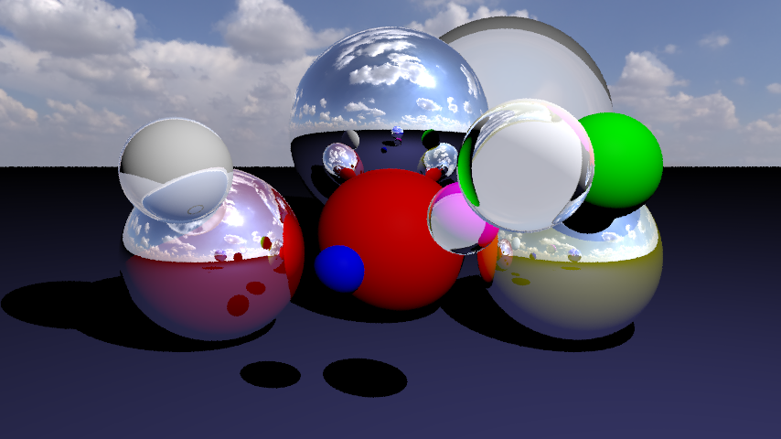

# How to Use the Raytracer
*(details coming later – work in progress)*

---

# Roadmap & Progress

This log shows the evolution of the raytracer.   
**Newest results are shown first.**

---

## Image 5 – Improved Glass + Skybox (Current)
- **Scene:** spheres with better glass material  
- **Features:** experimental reflections/refractions, working skybox  
- **Status:** current development stage  

---

## Image 4 – Skybox (In Progress)
- **Scene:** early skybox experiments  
- **Status:** partial implementation  

---

## Image 3 – Glass Spheres v2 (Old Version)
- **Scene:** more spheres, single light  
- **Glass Material:** second iteration (semi-functional)  
- **Render Specs:** 1920×1080, 6 spp, max depth 7  
- **Performance:** ~15 min (MacBook M1)  

---

## Image 2 – Cornell Box (Old Version)
- **Scene:** simple Cornell Box with spheres  
- **Glass Material:** first working attempt (semi-functional)  

---

## Image 1 – Glass Spheres v1 (Old Version)
- **Scene:** basic spheres with one light source

---
