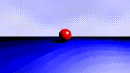
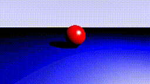
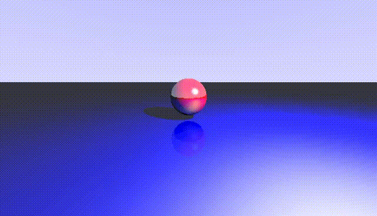

<p align="center">
  
</p>

[ **[HOME](../README.md)** &nbsp;|&nbsp;
  **[Theory](./raytracing.md)** &nbsp;|&nbsp;
  **[⭐️ Examples](./examples.md)** &nbsp;|&nbsp;
  **[Docs & API](./docs.md)** ]

<h1 align="center">Rendered Examples</h1>

---

<p align="center">
  <b>This section shows various examples of scenes rendered with this ray tracer.</b>
    <br><br>
  Project in active development — Structure and features may change frequently.<br>
</p>

---

# Navigation
- [Basic Scenes](#basic-scenes)
- [Advanced Scenes](#advanced-scenes)
- [Demonstrations](#demonstrations)
- [Animations](#animations)


## Basic Scenes

---

## Advanced Scenes

---

## Demonstrations

---

## Animations
- Animations have lower quality due to GIF format limitations.

### Zoom Animation - Linear Easing
- no anti-aliasing and only 1 bounce for performance reasons



🔗 [Full-quality MP4](./examples/zoom.mp4)

### Move and zoom Animation - Ease In Out
- no anti-aliasing and only 1 bounce for performance reasons



🔗 [Full-quality MP4](./examples/move_zoom.mp4)

### Complex Normal Shader Animation - Move, Rotate and Zoom - Linear Easing
  - uses same start and length for all animation components
  - anti-aliasing with 8 samples per pixel
  - 3 seconds duration at 24 frames per second
  - uses normal shader to visualize normals


🔗 [Full-quality MP4](./examples/complex_normal_shader.mp4)

### Complex Animation - Move, Rotate and Zoom - Linear Easing
  - uses different starting times and durations for each animation component
  - no anti-aliasing and 3 bounces
  - 17 frames per second
  - total duration 3 seconds



🔗 [Full-quality MP4](./examples/complex_animation.mp4)

#### Used Animation Setup Code Example
```python3
animation_setup = AnimationSetup(
    # camera move
    move_from = Vertex(0, 1.0, 2.0), # camera start position
    move_to   = Vertex(-4, 0.1, 0.5), # camera end position
  
    move_start_delay = 0.0, # starting immediately and moves for 1 second
    move_duration    = 1.0,

    # camera rotate yaw/pitch/roll
    rotate_axis      = Vector(-0.2, 1, 0.2), # rotate around this axis
    rotate_angle_deg = -60.0, # rotate to right in degrees
  
    rotate_start_delay = 0.5, # starts rotating after 0.5 seconds and rotates for 1.5 seconds
    rotate_duration    = 1.5,

    # zoom in
    zoom_from       = 80.0, # initial FOV
    zoom_to         = 35.0, # final FOV
  
    zoom_start_delay = 0.0, # starting immediately and zooms whole animation duration
    zoom_duration    = 3.0,
)
```

---

<p align="center">
  <b> Documentation is not complete yet. Works as a example of how to document the project. </b>
</p>

